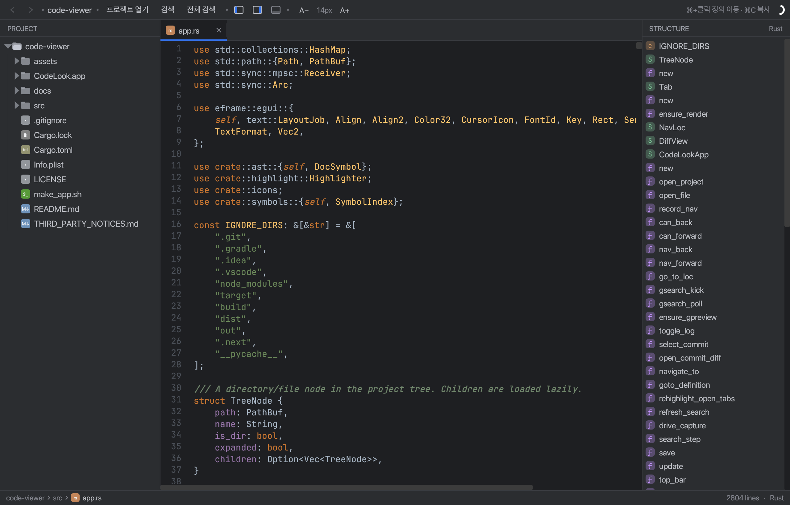

# CodeLook

A lightweight, **read-only** source code viewer with an IntelliJ‑like UI, written in Rust (egui).
Built for quickly *reading* and *reviewing* a codebase — not editing it.



## Features

- **IntelliJ New UI dark** look — JetBrains Mono for code, tonal panel/editor separation, tool‑window headers.
- **Project tree** with the official IntelliJ (expUI) file/folder icons — source/test/resources root variants, special names (Dockerfile, .gitignore, build.gradle.kts, …) — plus indent guides and full‑width selection.
- **Syntax highlighting** via tree‑sitter (Rust, Kotlin, Java, Python, Go, JS/TS) with a syntect/Darcula fallback for everything else.
- **Structure panel** — AST‑derived symbol outline with IntelliJ kind icons (class/method/field/…), click to jump.
- **⌘+Click go‑to‑definition** backed by a background‑built symbol index.
- **In‑file search** (⌘F) and **project‑wide search / Find in Files** (⇧⌘F) with live results, a code preview pane, and match highlighting.
- **Back / Forward navigation** (⌘[ / ⌘] or ⌥⌘← / ⌥⌘→, and mouse side buttons).
- **Git integration (read‑only):**
  - file status colors in the tree (modified / added / deleted),
  - gutter change bars vs HEAD (added / modified / deleted),
  - current branch in the status bar,
  - **commit log** panel + per‑commit **changed files** + **unified diff** viewer.
- **Tool‑window toggles** for the tree / structure / commit panels.
- Bottom **breadcrumb + status bar**.

## Build & run (macOS)

Requires a [Rust toolchain](https://rustup.rs). `libgit2` is built from source (vendored), so no system git library is needed.

```bash
# Run directly
cargo run --release -- /path/to/your/project

# Or build a double‑clickable macOS app bundle (CodeLook.app)
./make_app.sh
open CodeLook.app --args /path/to/your/project
```

You can also launch and then use **프로젝트 열기 / Open Project** to pick a folder.

## Keyboard shortcuts

| Action | Shortcut |
|---|---|
| Find in file | ⌘F |
| Find in project | ⇧⌘F |
| Go to definition | ⌘ + Click |
| Back / Forward | ⌘[ / ⌘] (or ⌥⌘← / ⌥⌘→, mouse side buttons) |
| Copy | ⌘C |

## Language support

Tree‑sitter grammars: Rust, Python, JavaScript, TypeScript, Java, Go, Kotlin, JSON.
All other file types fall back to syntect's TextMate grammars.

## Notes

- **Read‑only by design** — the editor reverts any typing; it never writes your files.
- Git features require the opened folder to be inside a git repository.

## Credits / third‑party

See [THIRD_PARTY_NOTICES.md](THIRD_PARTY_NOTICES.md). Bundles **JetBrains Mono** (SIL OFL 1.1), the **IntelliJ expUI icons** (Apache‑2.0), and the **Darcula** TextMate theme.

## License

MIT — see [LICENSE](LICENSE). (Bundled fonts/themes keep their own licenses.)
